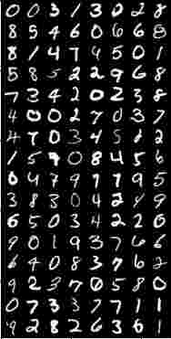

# MNIST classification

For MNIST model training:  
     ./mnist.py --mode train --dataset /path/to/dataset.csv --model /path/for/saving/model_weights 

For MNIST data classification:  
     ./mnist.py --mode inference --model /path/to/model_weights --input /path/to/input_data.csv --output /path/for/saving/predictions.csv

For predict evaluation:  
     ./evaluate.py --ground_truth /path/to/ground_truth.csv --predictions /path/to/predictions.csv

Config params are saved in config.py

### Before launching:
pip install -r requirements.txt

